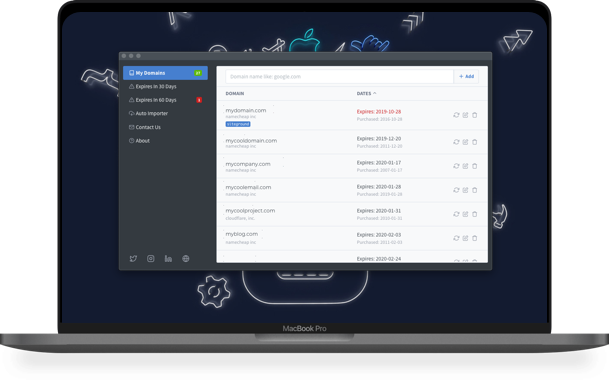
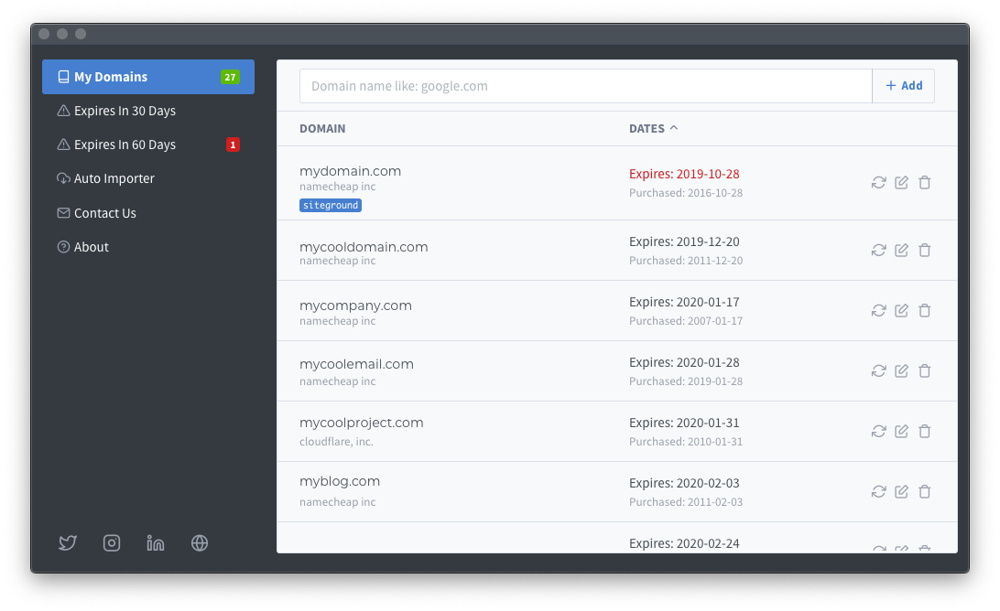
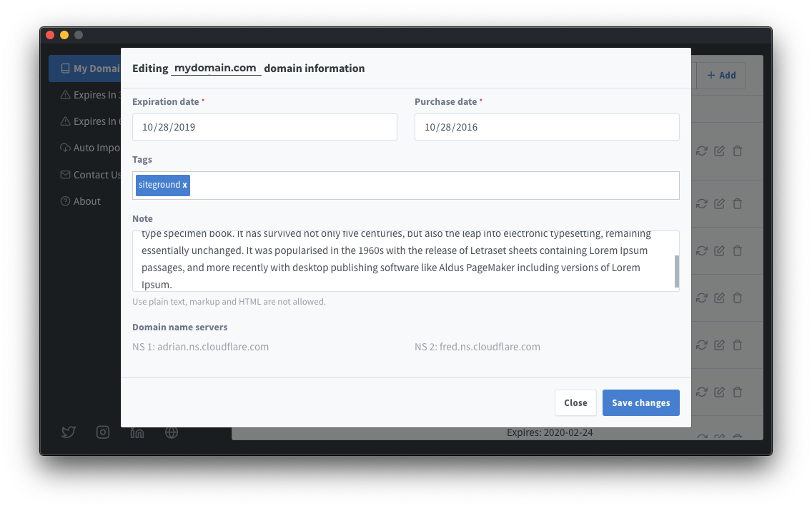
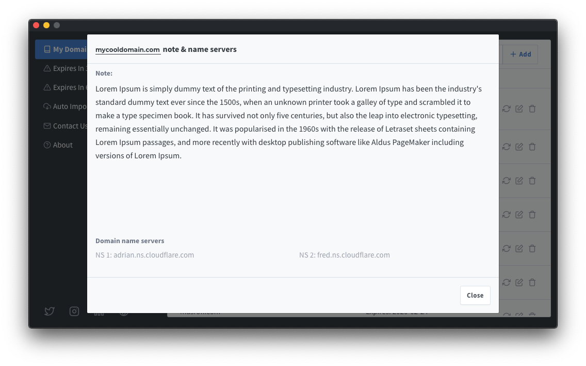
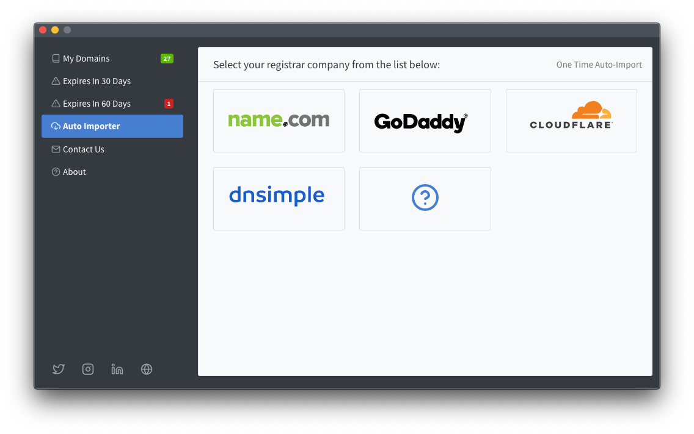
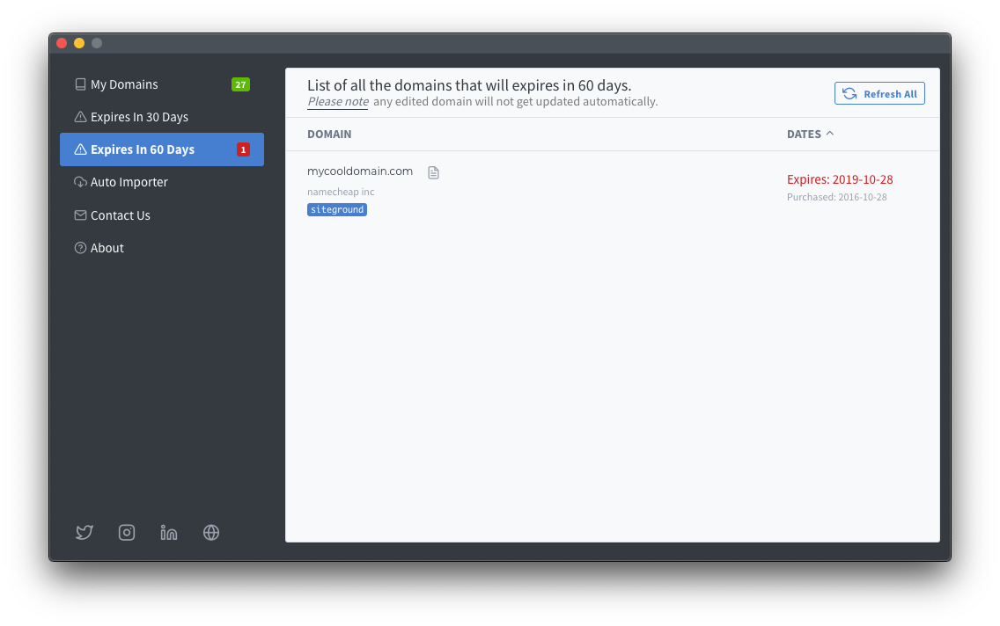

# Domain book application

Domain Book app, an easy and straightforward way to monitor your domains' expiration date.
It is like a phonebook for your domains.

You can buy it via [Paddle](https://pay.paddle.com/checkout/556574) for only [$9.99](https://pay.paddle.com/checkout/556574)

## Features

**Simple and Easy to use**

A simple UI to give you the critical information about your domains, especially when you have many domains with various registrars. All you need to do is adding your domain, and the app will get all the information required from the Internet. We support a long list of domains WHOIS servers. Also, you can refresh the domain information at any time. 

**Modify the local domain information**

If for some reason, we were not able to get a piece of accurate information about your domains, you can use the edit screen to correct this information. Also, you can add notes and tags to help remember anything about a specific domain name.

Once you modified the expiration date, a red dot will be shown near the domain to identify what you have changed. Meanwhile, if you added notes, a small page icon will appear which you can click to read these notes.

**Auto import**

By utilizing the powerful API that each registrar provide, we were able to provide this feature which allows you to auto import the list of your domains directly without the need to add them manually. Right now we only support four companies, and we are planning to add more shortly. 

**What will expire soon?**

We all know how it feels when you forget to renew your domain, that's why we have added two menus to our application, one to show you a list of all the domains which will expire in 30 days, the other one display the domains which will expire in 60 days. This way you will know when your domain will be renewed, no surprise payments anymore. 

## More info

This repository is created to gather feature requests & to submit any issues you might find.

More info about the application can be seen at [Darawish](https://darawish.io) website.
