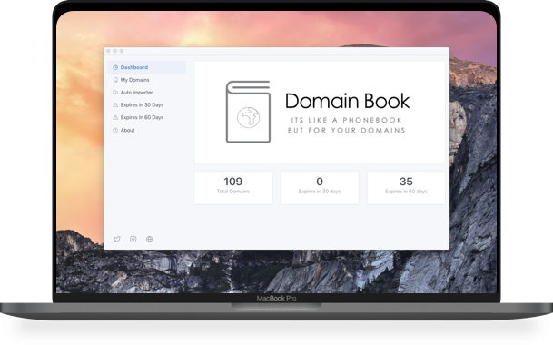
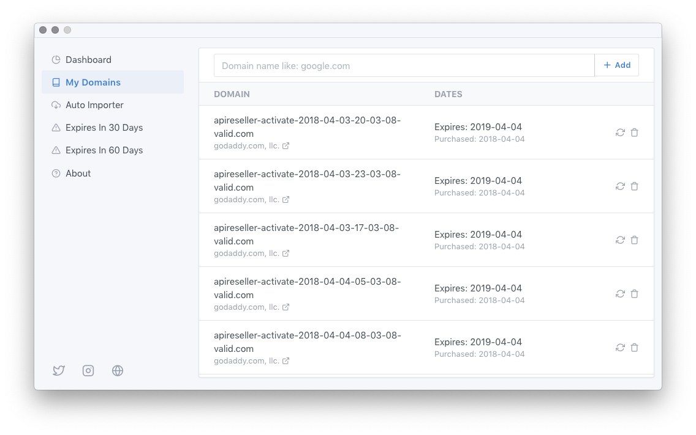
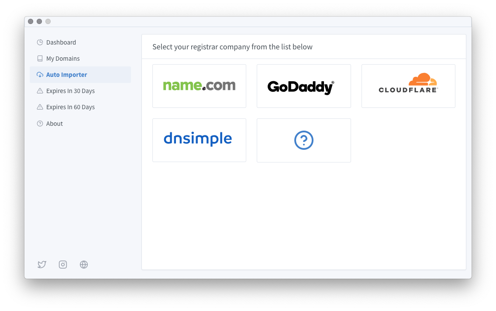
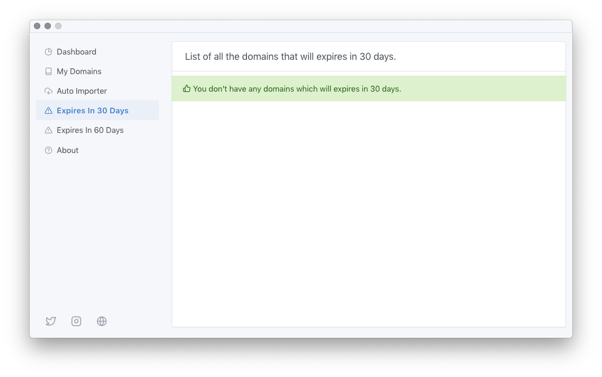
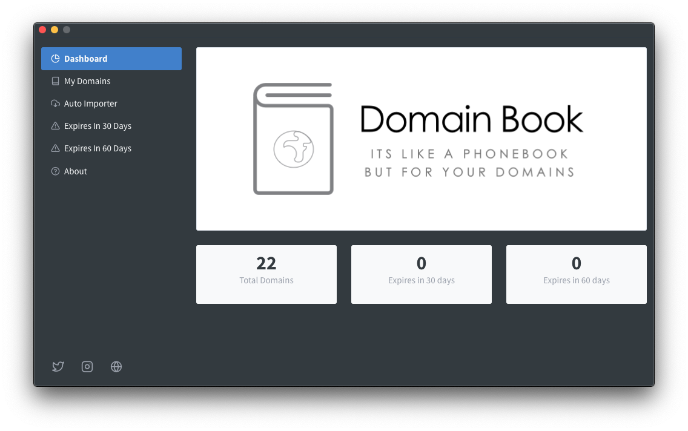

# Domain book app

An easy and simple way to monitor your domains,
it’s like a phone book but for your domains. 

## Features

**Simple and Easy to use**

A simple UI to give you the critical information about your domains, especially when you have many domains with various registrars. All you need to do is adding your domain, and the app will get all the information required from the internet. We support a long list of domains whois servers. Also, you can refresh the domain information at any time. 

**Auto import**

By utilizing the powerful API that each registrar provide, we were able to provide this feature which allows you to auto import the list of your domains directly without the need to add them manually. Right now we only support four companies, and we are planning to add more shortly. 

**What will expire soon?**

We all know how it feels when you forget to renew your domain, that's why we have added two menus to our app, one to show you a list of all the domains which will expire in 30 days, the other one display the domains which will expire in 60 days. This way you will know when your domain will be renewed, no surprise payments anymore. 

**Dark mode support**

We just released version 1.2.7 which include Dark theme based on your system appearance preferences, so it is not manually set.

## More info

This repositoroy is created to gather feature requets & to submit any issues you might find.

More info about the app can be seen at [Darawish](https://darawish.io) website.
